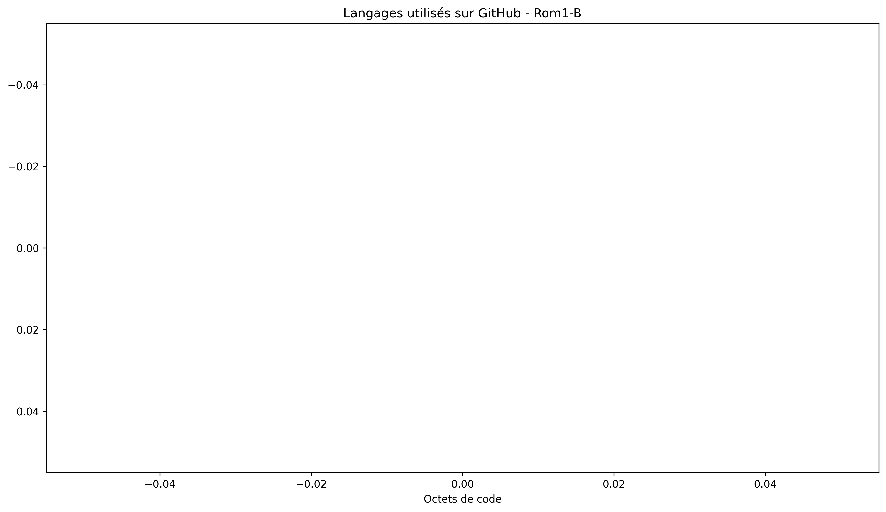

<!-- typing SVG -->
<p align="center">
  <a href="https://readme-typing-svg.demolab.com">
    
  </a>
</p>

---

### About me

PHP Developer at **[Teclib'](https://teclib-edition.com)** - makers of [GLPI](https://github.com/glpi-project/glpi), the open-source ITSM platform.

```yaml
focus:
  - IT asset management & ITSM (GLPI)
  - Home automation (Home Assistant)
  - Clean, maintainable code - no magic, no surprises

open_to: "interesting problems & open-source collaboration"
```


---

### 📊 GitHub Stats



| Langage | Octets | % |
|---------|--------|-----|

*Dernière mise à jour: 2026-05-02 08:14:50 UTC*
